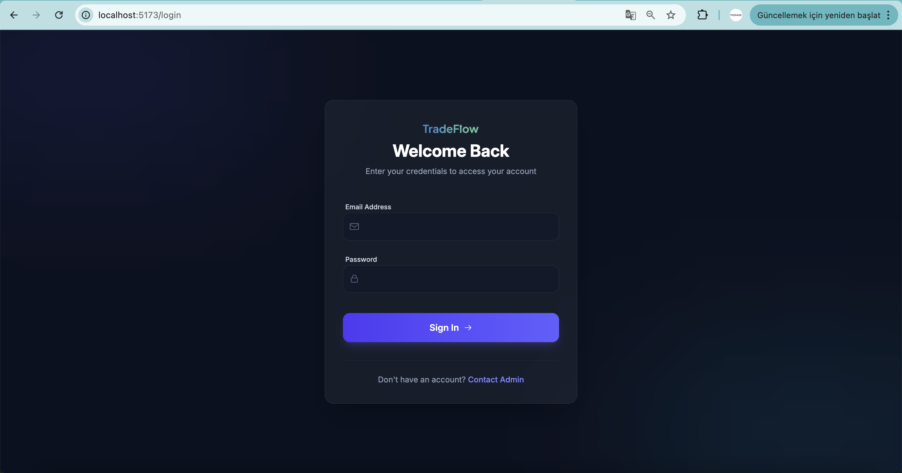
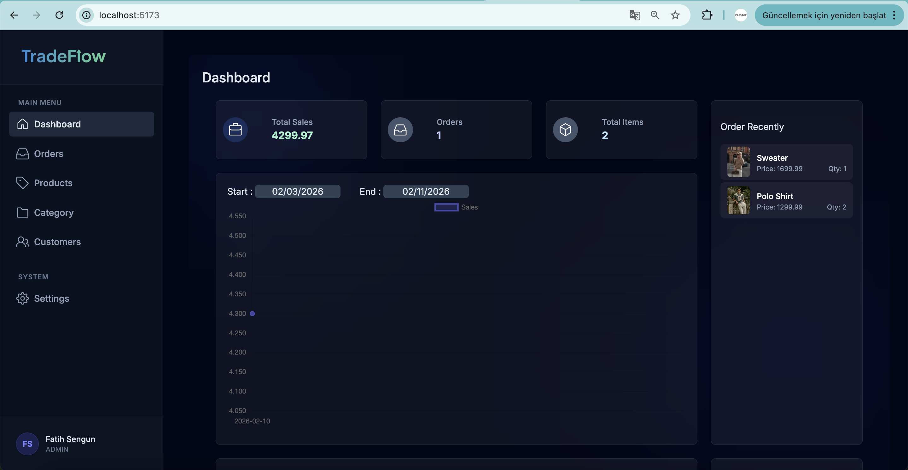
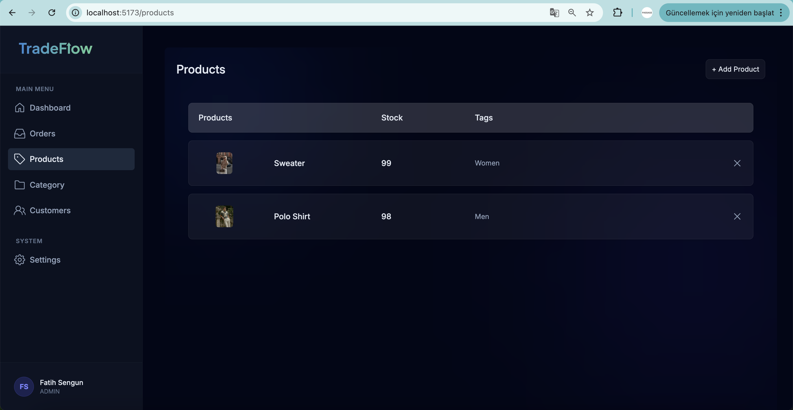

# TradeFlow 🚀 | Modern E-Commerce Admin Dashboard

**TradeFlow** is a modern and responsive Admin Dashboard project designed to manage e-commerce processes, featuring a stylish **Glassmorphism** design language. It offers a comprehensive management experience with product management, order tracking, category operations, and advanced security layers.

---

## 🌟 Key Features

### 🔐 Security & Authentication
- **JWT-Based Login:** Secure session management with Access and Refresh token structure.
- **Smart Axios Interceptors:** - Automatically handles **Refresh Token** operations in the background when the token expires (401 error) without interrupting the user experience.
  - Safely redirects the user to the Login page if the refresh token is invalid or expired.
- **Role-Based Access:** Content and feature management based on user roles.

### 📦 Product & Category Management
- **CRUD Operations:** Create, Read, Update, and Delete features for products and categories.
- **Dynamic Tables:** Responsive product and stock lists presented in a modern grid layout.

### 🛒 Order Management
- **Order Tracking:** Monitor the status of incoming orders (Pending, Completed, Cancelled), total amounts, and customer details.
- **Detail Page:** A dedicated detail page displaying the products included in each order along with delivery addresses.

### 🎨 UI/UX Design
- **Glassmorphism:** A modern interface featuring frosted-glass effects, built using Tailwind CSS.
- **Responsive Sidebar:** Collapsible menu for mobile devices and a fixed sidebar for desktop views.
- **Profile Management:** Admin profile page with a secure logout process.

---

## 📸 Screenshots

### 1. Login Screen
A modern and stylish login page featuring ambient light effects and glass panels.

### 2. Dashboard & Charts
The main screen displaying general sales status and summary information.

### 3. Product Management
The panel where products are listed with stock and category information.

---

## 🛠️ Technologies

The core technologies and libraries used in this project:

- **Frontend Framework:** React (TypeScript)
- **Styling:** Tailwind CSS (Custom Config)
- **HTTP Client:** Axios (Custom Interceptors)
- **Routing:** React Router DOM
- **Icons:** React Icons (Go Icons)
- **Alerts:** SweetAlert2
- **State Management:** React Hooks (useState, useEffect, Context API)
